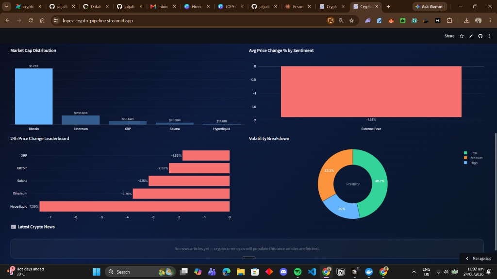
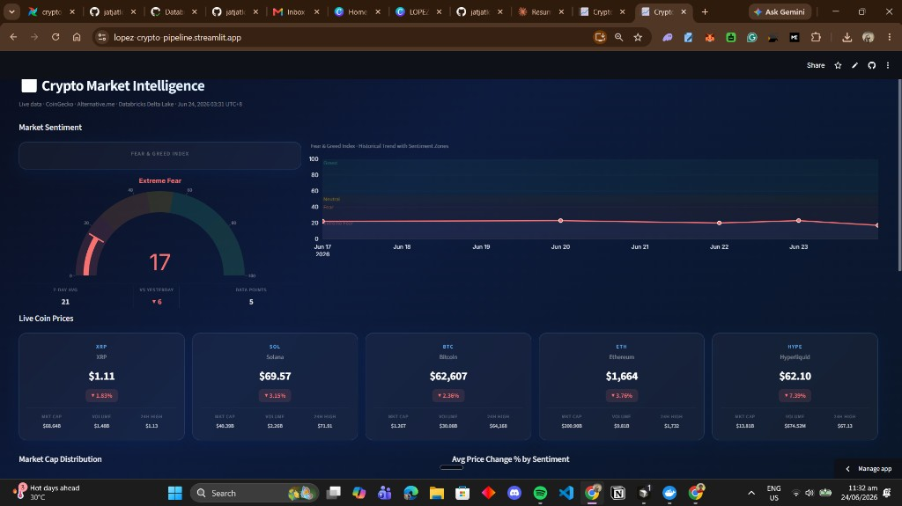
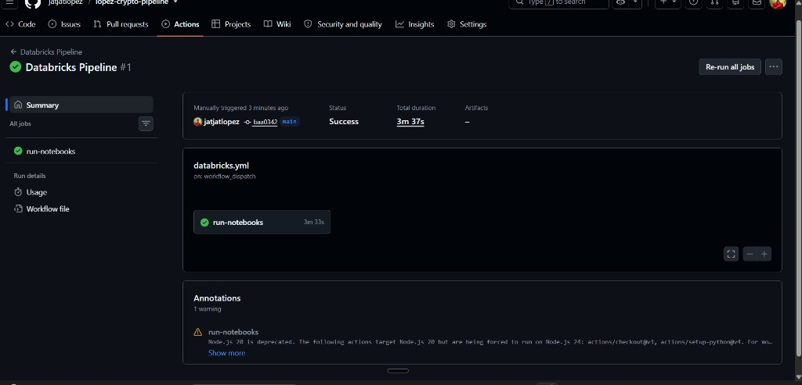
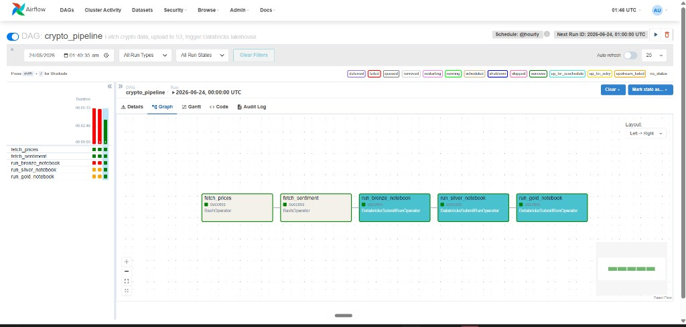
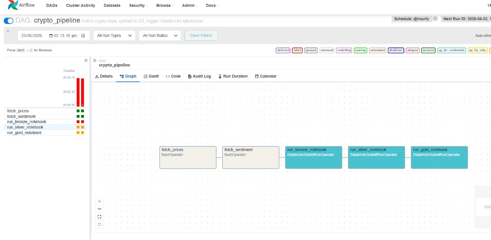

# 📈 Crypto Market Intelligence Pipeline

> An end-to-end, production-grade data engineering pipeline for real-time cryptocurrency market analysis and sentiment tracking — built entirely with free tools.

<div align="center">

**[🚀 Live Dashboard](https://lopez-crypto-pipeline.streamlit.app)** &nbsp;·&nbsp;
**[Architecture](#architecture)** &nbsp;·&nbsp;
**[Tech Stack](#tech-stack)** &nbsp;·&nbsp;
**[Pipeline Layers](#pipeline-layers)** &nbsp;·&nbsp;
**[Setup](#running-locally)**


</div>

---

## Dashboard Preview


*Fear & Greed gauge, live coin prices with 24h stats*


*Market cap distribution, sentiment correlation, volatility breakdown, leaderboard*

---

## Architecture

```
┌─────────────────────────────────────────────────────────────────────┐
│                     DATA SOURCES (3 APIs)                           │
│  CoinGecko (prices) · Alternative.me (sentiment) · cryptocurrency.cv│
└──────────────────────┬──────────────────────────────────────────────┘
                       │ Every hour via GitHub Actions
                       ▼
┌─────────────────────────────────────────────────────────────────────┐
│                  INGESTION LAYER (Python)                           │
│  fetch_prices.py · fetch_sentiment.py · s3_upload.py               │
│  Idempotent · State-tracked · Hive-partitioned (year/month/day/hr)  │
└──────────────────────┬──────────────────────────────────────────────┘
                       │
                       ▼
┌─────────────────────────────────────────────────────────────────────┐
│                    AWS S3 (Data Lake)                               │
│  s3://crypto-pipeline-raw-lopez/                                    │
│  ├── prices/year=2026/month=06/day=24/hour=10/data.json            │
│  ├── fear_greed/year=2026/month=06/day=24/hour=10/data.json        │
│  └── news/year=2026/month=06/day=24/hour=10/data.json              │
└──────────────────────┬──────────────────────────────────────────────┘
                       │ Every 4 hours via GitHub Actions
                       ▼
┌─────────────────────────────────────────────────────────────────────┐
│               DATABRICKS LAKEHOUSE (Delta Lake)                     │
│                                                                     │
│  Bronze Layer  →  Silver Layer  →  Gold Layer                       │
│  (raw JSON)       (cleaned,         (joined fact table:             │
│                    typed,            gold_price_sentiment)           │
│                    deduped)                                         │
│                                                                     │
│  Orchestrated by Apache Airflow + GitHub Actions                    │
└──────────────────────┬──────────────────────────────────────────────┘
                       │
                       ▼
┌─────────────────────────────────────────────────────────────────────┐
│                    dbt Core (SQL Transforms)                        │
│  mart_price_sentiment · mart_volatility_summary                     │
│  Schema tests · Source declarations · Unity Catalog integration     │
└──────────────────────┬──────────────────────────────────────────────┘
                       │
                       ▼
┌─────────────────────────────────────────────────────────────────────┐
│              STREAMLIT DASHBOARD (Deployed — Public URL)            │
│  lopez-crypto-pipeline.streamlit.app                                │
│  Fear & Greed Gauge · Live Prices · Charts · News Feed              │
└─────────────────────────────────────────────────────────────────────┘
```

---

## Pipeline Layers

### 🟤 Bronze — Raw Ingestion
Reads raw JSON files directly from S3 using `boto3`. No transformations applied. Stores data as-is into Delta tables (`bronze_prices`, `bronze_fear_greed`, `bronze_news`). Handles nested JSON structures using pandas as an intermediary for Databricks Serverless compute compatibility.

### ⚪ Silver — Cleaned & Typed
Reads Bronze tables, applies:
- Type casting (`current_price` → double, `last_updated` → timestamp)
- Null filtering on critical fields
- Deduplication by `(id, last_updated)`

Produces `silver_prices`, `silver_fear_greed`, `silver_news`.

### 🥇 Gold — Analytical Fact Table
Joins Silver prices with Silver fear/greed sentiment on matching time windows. Adds derived columns:
- `volatility_category` — Low / Medium / High based on 24h price change
- `ingestion_hour` — for time-based partitioning in analytics

Produces `gold_price_sentiment` — the single source of truth for the dashboard.

### 💎 dbt Marts
SQL-based transformations on top of Gold:
- `mart_price_sentiment` — final fact table with all key metrics
- `mart_volatility_summary` — aggregated summary grouped by sentiment + volatility

---

## Tech Stack

| Category | Technology | Purpose |
|---|---|---|
| **Language** | Python 3.11 | Ingestion scripts |
| **Cloud Storage** | AWS S3 | Raw data lake (Hive partitioned) |
| **Big Data** | Apache Spark / PySpark | Distributed data processing |
| **Lakehouse** | Databricks + Delta Lake | Bronze/Silver/Gold layers |
| **Transformation** | dbt Core | SQL models, tests, lineage |
| **Orchestration** | Apache Airflow 2.9 | Local pipeline scheduling |
| **Automation** | GitHub Actions | Cloud-scheduled (24/7, free) |
| **Containerisation** | Docker + Docker Compose | Reproducible environments |
| **Dashboard** | Streamlit + Plotly | Interactive web app |
| **Version Control** | Git + GitHub | Source control |

---

## Automation

### GitHub Actions (Runs 24/7 — Free Tier)

| Workflow | Schedule | What it does |
|---|---|---|
| `ingest.yml` | Every hour | Fetches prices + sentiment → uploads to S3 |
| `databricks.yml` | Every 4 hours | Triggers Bronze → Silver → Gold notebooks |


*Both workflows running successfully in the cloud*

### Apache Airflow DAG


*All 5 tasks green — full pipeline execution in under 5 minutes*

The DAG (`crypto_pipeline`) runs:
```
fetch_prices → fetch_sentiment → run_bronze → run_silver → run_gold
```

---

## Databricks Pipeline


*Gold layer notebook — joined fact table with sentiment + price data*

Key technical decisions:
- Used `boto3` instead of `spark.conf.set` for S3 access (Serverless compute restriction)
- Used `pandas` as intermediary for nested JSON → Spark DataFrame conversion
- Configured Unity Catalog (`workspace.default.*`) for all table references
- All `saveAsTable` calls use fully-qualified `workspace.default.table_name` format

---

## Data Sources

| Source | Data | API |
|---|---|---|
| [CoinGecko](https://coingecko.com) | BTC, ETH, SOL, XRP, HYPE prices, market cap, volume | Free Demo API |
| [Alternative.me](https://alternative.me/crypto/fear-and-greed-index/) | Fear & Greed Index (0–100) with classification | Free |
| [cryptocurrency.cv](https://cryptocurrency.cv) | Crypto news headlines | Free tier |

---

## Project Structure

```
crypto-pipeline/
├── ingestion/                  # Python ingestion scripts
│   ├── fetch_prices.py         # CoinGecko API → S3
│   ├── fetch_sentiment.py      # Alternative.me + news → S3
│   ├── s3_upload.py            # Shared S3 upload helper
│   └── run_all.py              # Entry point
├── notebooks/                  # Databricks notebooks (PySpark)
│   ├── 01_bronze_layer.ipynb
│   ├── 02_silver_layer.ipynb
│   └── 03_gold_layer.ipynb
├── crypto_transform/           # dbt Core project
│   └── models/marts/
│       ├── mart_price_sentiment.sql
│       ├── mart_volatility_summary.sql
│       ├── sources.yml
│       └── schema.yml
├── airflow/                    # Airflow orchestration
│   ├── dags/
│   │   └── crypto_pipeline_dag.py
│   ├── Dockerfile
│   ├── requirements.txt
│   └── docker-compose.yml
├── dashboard/                  # Streamlit dashboard
│   ├── app.py
│   └── requirements.txt
├── .github/workflows/          # GitHub Actions CI/CD
│   ├── ingest.yml
│   └── databricks.yml
├── Dockerfile                  # Ingestion container
├── docker-compose.yml          # Ingestion stack
└── requirements.txt            # Python dependencies
```

---

## Running Locally

### Prerequisites
- Python 3.11
- Docker Desktop
- AWS credentials (S3 access)
- Databricks account (free trial)

### Ingestion

```bash
git clone https://github.com/jatjatlopez/lopez-crypto-pipeline
cd lopez-crypto-pipeline

pip install -r requirements.txt

# Create .env with your credentials
cp .env.example .env  # then fill in your keys

python ingestion/run_all.py
```

### Dashboard

```bash
cd dashboard
pip install -r requirements.txt

# Create dashboard/.streamlit/secrets.toml
echo 'DATABRICKS_TOKEN = "your-token"' > .streamlit/secrets.toml

streamlit run app.py
```

### Airflow

```bash
cd airflow
docker-compose -f docker-compose.yml up airflow-init
docker-compose -f docker-compose.yml up airflow-webserver airflow-scheduler
# Open http://localhost:8081 → admin/admin
```

---

## Key Engineering Decisions

| Challenge | Solution |
|---|---|
| Databricks Serverless blocks `spark.sparkContext` | Used `boto3` + `pandas` → Spark DataFrame instead |
| dbt incompatible with Python 3.14 (`mashumaro` error) | Dedicated Python 3.11 venv for dbt |
| Unity Catalog vs Hive Metastore | Identified `workspace.default` as correct catalog/schema, updated all table refs |
| GitHub Actions secrets | Used GitHub repository secrets, never committed credentials |
| CoinGecko API replaced CryptoPanic (paid) | Switched to Alternative.me (free) + cryptocurrency.cv (free) |

---

## What I Learned

- Designing a **Medallion Architecture** (Bronze/Silver/Gold) for a real data product
- Debugging **distributed computing** issues on Databricks Serverless compute
- Applying **idempotency** principles to data ingestion (state tracking, partitioning)
- Using **dbt Core** for SQL transformation with Unity Catalog integration
- Deploying a full **data application** end-to-end from APIs to a live dashboard
- Setting up **CI/CD for data pipelines** using GitHub Actions

---

<div align="center">
  Built by <a href="https://github.com/jatjatlopez">John Lopez</a> · <a href="https://lopez-crypto-pipeline.streamlit.app">Live Dashboard</a>
</div>
